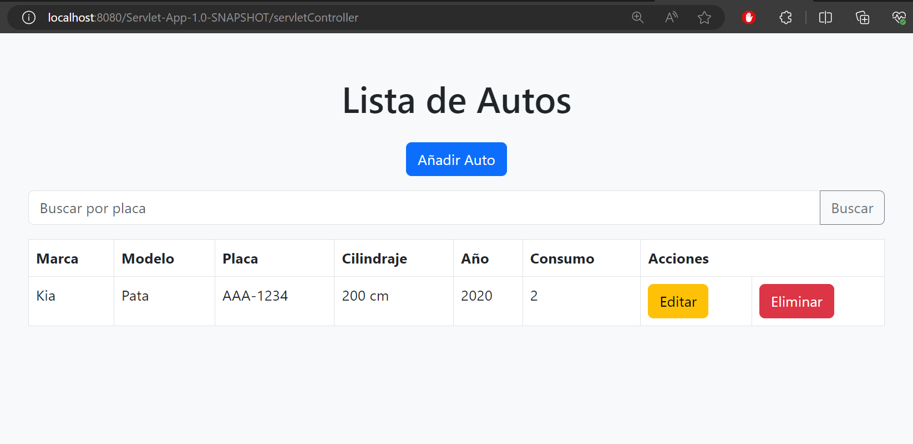
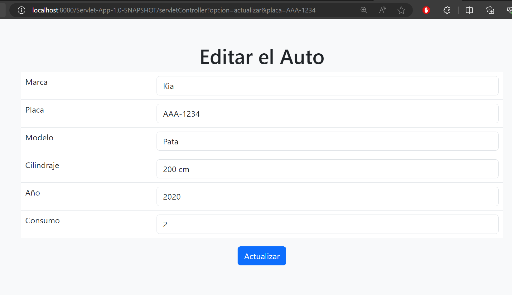
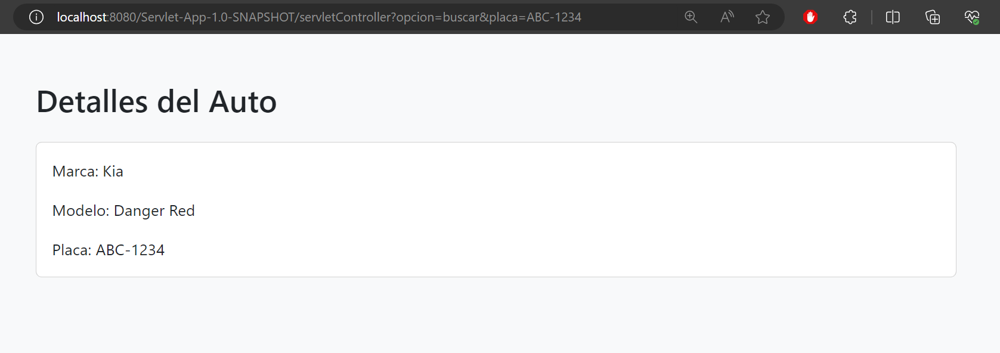

# Java Servlet CRUD for Cars

This project implements a simple CRUD (Create, Read, Update, Delete) for cars in Java using Servlets. The CRUD allows managing car information, storing data in memory.

### **Select Language:**
- [Español (Spanish)](README-es.md)
- [English](README.md)

## Result
### Home

### Add

### Edit

### Search

## Project Structure

The project consists of various classes and files working together to achieve CRUD functionality.

### Java Classes

1. **AutoServletController (servletController.java)**
    - Handles HTTP requests, manages CRUD logic, and redirects to corresponding pages.
    - Notable methods: `doGet()`, `doPost()`, `init()`, `destroy()`.

2. **AutoDaoImplement (AutoDaoImplement.java)**
    - Implements the `IAutoDAO` interface and manages storage and manipulation of car data in memory.
    - Notable methods: `add()`, `update()`, `get()`, `getAuto()`, `delete()`.

3. **Auto (Auto.java)**
    - Represents the Auto entity with attributes like brand, model, license plate, displacement, year, and consumption.
    - Provides getters, setters, and a `toString()` method for easy visualization.

4. **MemoryStore (MemoryStore.java)**
    - Stores cars in memory using a HashMap.
    - Provides methods to add, update, retrieve, list, and delete cars.

### JSP Files (JavaServer Pages)

1. **index.jsp**
    - Displays a list of cars with options to edit or delete.

2. **crear.jsp**
    - Form for adding new cars.

3. **actualizar.jsp**
    - Form for editing information of an existing car.

## Project Usage

1. **Environment Setup**
    - Ensure you have a Java environment and a configured web server (e.g., Apache Tomcat).

2. **Compilation and Deployment**
    - Compile Java classes and package the project into a WAR file.
    - Deploy the WAR file to your web server.

3. **Access the Application**
    - Open a web browser and access the application URL.

4. **Interact with the CRUD**
    - Use the web interface to create, read, update, and delete cars.

## Technologies Used

- Java Servlets
- JSP (JavaServer Pages)
- HTML, Bootstrap (for the user interface)

## Additional Notes

- The application uses in-memory storage (`MemoryStore`) for simplicity. In a real production environment, consider using a database.

- The project follows the basic Model-View-Controller (MVC) design pattern to separate concerns and enhance code maintainability.

- The user interface utilizes Bootstrap for a more appealing and responsive design.

**Enjoy working with the Java Servlet Cars CRUD!**

